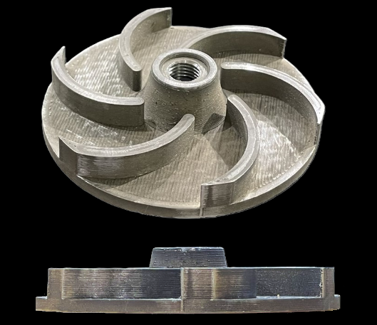

# Aerospace Engineering Graduate

#### Technical Skills: SolidWorks, CATIA V6, Engineering Drawings, Python, MATLAB, MS Office

## Education       		
- B.S., Aerospace Engineering | Massachusetts Institute of Technology (_May 2025_)

## Areas of Interest
- Propulsion, Advanced Manufacturing, Aero Structures, Energy Generation, and Actuators

## Professional Experience
**Undergraduate Researcher @ MIT HAUS (_June 2023 - Present_)**
- Designed, assembled, and succesfully implemented a CO2 pressurization system to create foaming pellets at a new scale for additive manufacturing.
- Demonstrated viability of increasing layer height on pile footing prints as a means of reducing print time while maintaining satisfactory performance. [Publication](https://doi.org/10.1007/978-3-031-77697-7_16)
- Reduced part the mass of a **HUD compliant** roof design by 30% by using **SolidWorks FEA** to validate new geometries.
- Assisted fellow undergraduate researchers in BAAM use and validated new print surfaces.
- Compiled relevant **ASTM** and **ISO** standards for preliminary characterization of our BAAM 3D printer.
<!-- insert pictures here -->

**Engineering Intern @ Radia, Inc. (_June 2024 - August 2024_)**
- Sized composite panels according to durability and deflection requirements while minimizing weight by creating a **MATLAB** model relating mass and deflection. Analyzed half a dozen potential failure modes for composite panels reinforced by hat-stiffeners using hand calcs and relevant NACA literature.
- Proposed a new fairing design and substantiated it with drag impact calculations and analysis on manufacturability. Conducted a trade study to determine ideal panel dimensions subject to transportation, weight, and assembly considerations. Advocated for these and other key design decisions during weekly meetings with other stakeholders.
- Made a **CATIA** model using 3DXPERIENCE for my team’s structural concept while allowing for interaction with adjacent aircraft systems.

## Projects
### Home-Built Jet Engine
Developed a ceramic matrix composite that could be manufactured at home and withstand 2000 °C. Molded the composite around 3D printed PLA forms for easy reproducibility and consistency between mating surfaces upon assembly. Milled different fuel injectors to allow for tuning between runs. Calculated areas for each stage of air addition and fuel injection to reduce exhaust temperatures and extend turbine lifespan. Welded a test rig to hold the jet engine, a protective piece of acrylic and pressure and temperature gauges.
<!-- insert pictures, descriptions here -->

.JPEG)

### Deep Sea Soil Sampler
Designed and constructed a mechanically activated and actuated sediment collector used at a
depth of 11km for Victor Vescovo’s sea exploration. Used aluminum linkages and pulleys to efficiently transfer spring energy to
a sample collector. Calculated pressure plate area and geometry to avoid premature triggering from shocks and descent in the water column. Tested different scoop designs and end-caps to maximize the sample
volume captured and retained.

<!-- insert pictures, descriptions here -->

### Dual Fluid Impeller System
Designed a fluid impeller and casing for metal and polymer SLS
manufacturing, navigating the challenge of uncertain achievable tolerances. Created **engineering drawings** for the
impeller and casings. Achieved the lowest leakage of all six teams in the class and avoided near-critical operation.

### Satellite Design and Analysis
Designed a fictional probe mission to Europa. Ensured the satellite packaging could fit within a
Falcon Heavy fairing and survive the vibrational environment of takeoff. Reduced cantilevers and selected
composites where appropriate to eliminate dangerous vibrational modes using SolidWorks FEA tools.

### Canonical Heat Addition Case
Produced a report discussing the canonical case of heat addition and removal from a stovepipe
ramjet as part of Compressible Internal Flows coursework.

## Talks & Lectures
- Guest Presentation: MIT HAUS First-of-Kind Prototypes - Dual Use Innovation Day, Spring 2025
<!-- insert pictures, descriptions here -->

## Potential Future Projects
**Manufacturing**
- Assembleable minimal surfaces to guide fibers for the creation of dense 3D composites with complex shapes.
- Expanding the range of particle velocity and mass flow rate through cold spray nozzles via revised geometries.

**Robotics**
- MEMS cooling system to minimize heat buildup despite smaller apertures achieved through higher back pressure. May enable improvements in air flow following Moore's Law.
- Additively manufactured NiTi compliant mechanisms for high-load applications.

**Propulsion**
- Plasma stabilization of high Mach combustion for reduced static temperature rise. Enable the use of less exotic alloys and composites in turbines.

**Athletics**
- Portable PSA-based hypoxicator and breathing system for altitude training on the go.
- Replicate CO2 infusion from PET in PEBA for 3D printed shoe sole prototypes.

Ask me about these or other ideas you may want to discuss.

## Publications
1. Perez, A.A., Arroyo, P., Sehnawi, K.H., Chandar, A.S., Hardt, D.E. (2025) Layer Height Treatments on Uniaxial Compression Performance of Industrial Large-Scale Additively Manufactured Polymer Composite Structures. In: Lopresto, V., Papa, I. (eds) Dynamic Response and Failure of Composite Materials. DRAF 2024. Lecture Notes in Mechanical Engineering. Springer, Cham. [https://doi.org/10.1007/978-3-031-77697-7_16]

## Other Projects
I have made 

### Artwork

## Appendix

